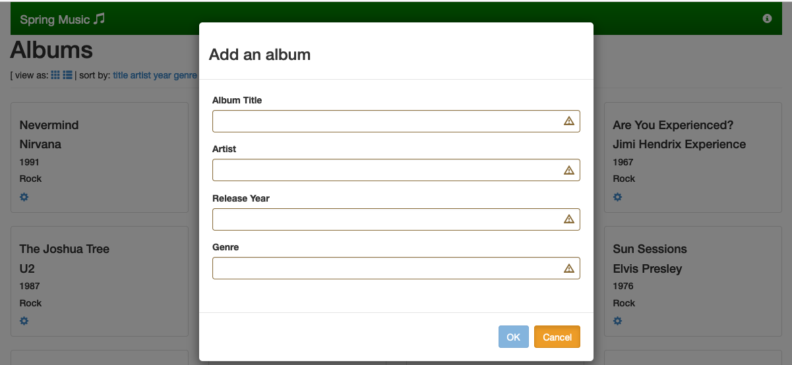

# Add a Like-Button to Spring Music application
Spring Music is an application that shows albums for certain artists. As a user you can add new albums, edit or delete existing albums.

You are also able to sort the album list:

In order to simulate project work with a customer, you will get user story definition. You can completely free how to solve this feature in Spring Music. You can use all resources.

## User Story
*As a user I want to like albums, so I can see only my liked albums*

## Acceptance criteria
* A like button is placed to each album
* The like-details are stored persistent in the database (in-memory, database)
* The filtering is extended to show only liked albums
* Unit tests are implemented an ensures that everything works properly

## Implementation hints
* A user-management or security-context is not required
